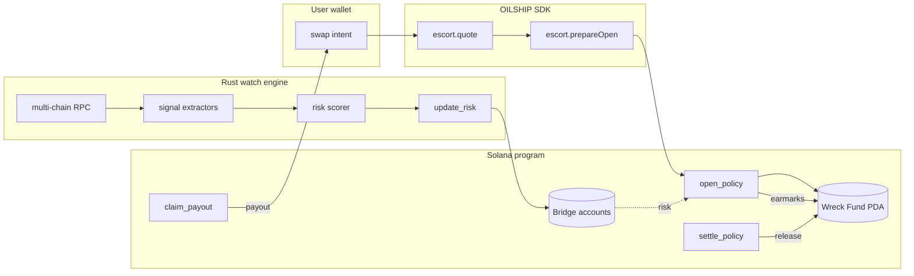

# OILSHIP — Strait Convoy

> Solana has one chokepoint to the rest of crypto: **the bridges**.
> Pirates wait there. OILSHIP is a convoy company that escorts your
> transit, monitors the strait, and pays you out of its **Wreck Fund**
> if anything sinks.

Since 2021, cross-chain bridges have lost more than **$2.8 billion** to
pirates. Wormhole. Ronin. Nomad. Multichain. Orbit. The pirates know
exactly where to wait. The existing answer is "buy insurance from a DAO
that votes on your claim for two weeks". That isn't insurance — that's
a wake.

OILSHIP is the answer that actually fits a Solana trader's life:

- **One toll, one decision, one transit.** You pay 10 bps and a tanker
  carries your cargo through the strait.
- **Same-block payouts.** If the watch engine flags the bridge while
  your policy is open, you walk away with your principal in the same
  block. No DAO vote. No claim form. The code pays.
- **Owned by shareholders.** Holding `$OIL` is a share in the fleet,
  the tolls and the Wreck Fund.

---

## Architecture

