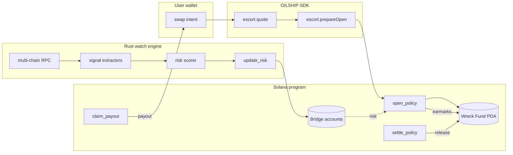
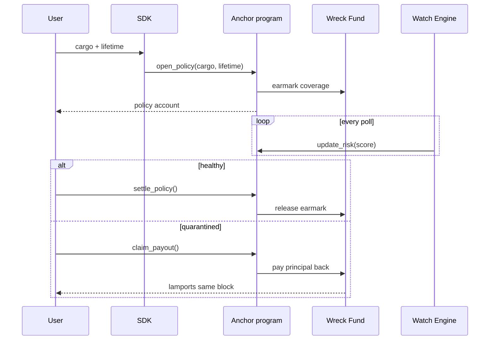
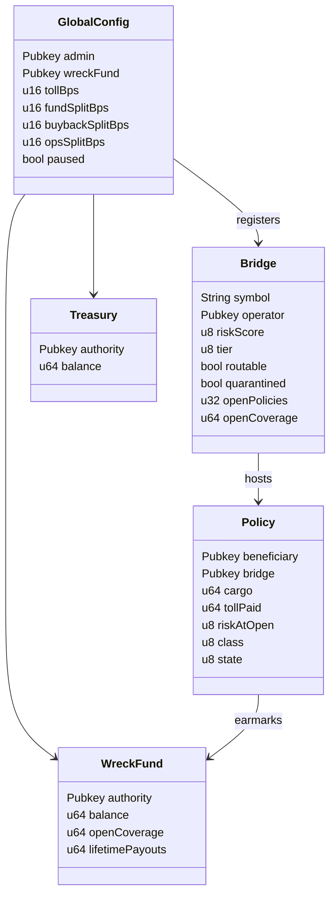

[](#)
[](#)
[](#)
[](#)
[](#)
[](#)
[](#)

# OILSHIP — Strait Convoy

> Solana has one chokepoint to the rest of crypto: **the bridges**.
> Pirates wait there. OILSHIP is a convoy company that escorts your
> transit, monitors the strait, and pays you out of its **Wreck Fund**
> if anything sinks.

Since 2021, cross-chain bridges have lost more than **$2.8 billion** to
pirates. Wormhole. Ronin. Nomad. Multichain. Orbit. The pirates know
exactly where to wait. The existing answer is "buy insurance from a DAO
that votes on your claim for two weeks". That isn't insurance — that's
a wake.

OILSHIP is the answer that actually fits a Solana trader's life:

- **One toll, one decision, one transit.** You pay 10 bps and a tanker
  carries your cargo through the strait.
- **Same-block payouts.** If the watch engine flags the bridge while
  your policy is open, you walk away with your principal in the same
  block. No DAO vote. No claim form. The code pays.
- **Owned by shareholders.** Holding `$OIL` is a share in the fleet,
  the tolls and the Wreck Fund.

---

## Architecture



The fleet is built from four pieces of software, all in this repo
under `product/`:

| Path | What it is | Stack |
|---|---|---|
| `programs/oilship/` | The on-chain program. | Rust + Anchor |
| `watch/`            | The monitoring engine. | Rust + Tokio |
| `sdk/`              | The TypeScript SDK. Zero runtime deps. | TypeScript |
| `cli/`              | The operator CLI. | Python + Typer |

---

## Mechanism



The toll a user pays is the **base toll** (10 bps of cargo) multiplied
by a **risk multiplier** read off the bridge's current score:

| Score | Multiplier |
|------:|-----------:|
| 0–20  | 0.95×      |
| 21–40 | 1.00×      |
| 41–60 | 1.15×      |
| 61–80 | 1.35×      |
| 81+   | 1.90×      |

Above score 80, the bridge is **quarantined** and the protocol refuses
to open new policies on it altogether.

---

## On-chain accounts



---

## Token economics

`$OIL` is the company share. There is no governance theatre and no
roadmap — the protocol does one thing and the share captures cashflow
from that one thing.

```
toll = bpsOf(cargo, 10) * risk_multiplier(score)
   |
   +-- 60 % --> wreck_fund    (grows the coverage cap)
   +-- 30 % --> $OIL buyback  (direct to holders)
   +-- 10 % --> operations    (RPCs, signers, infra)
```

| Quantity | How it is computed |
|---|---|
| **NAV**   | `wreck_fund + accrued_tolls − open_risk` |
| **APR**   | `(tolls − payouts) / wreck_fund` |
| **Floor** | `wreck_fund / circulating_supply` |
| **TAM**   | Solana monthly bridge inflow, measurable on chain |

There is no whitepaper. There is no fake metric.

---

## Repository layout

```
product/
├── README.md
├── assets/
│   ├── banner.png
│   └── logo.png
├── programs/oilship/        rust + anchor on-chain program
├── watch/                   rust monitoring engine
├── sdk/                     typescript sdk
├── cli/                     python typer cli
└── docs/architecture.md
```

---

## Installation

```bash
git clone <this repository>
cd product
```

Each component has its own build instructions in the respective
sub-directory.

---

## Examples

### Quote a transit

```ts
import { OilshipClient, Escort, solToLamports, pubkey } from "@oilship/sdk";

const client = new OilshipClient({
  rpcUrl: "https://api.mainnet-beta.solana.com",
  programId: pubkey("11111111111111111111111111111111"),
});
const escort = new Escort(client, 10);

const quote = await escort.quote({
  cargo: solToLamports(1.5),
  preferredBridge: "mayan",
});
console.log(Escort.renderQuote(quote));
```

### Watch a bridge

```bash
oilship-watch sample mayan
```

### Simulate a risk score

```bash
oilship threat simulate ./scenario.json
```

`scenario.json`:

```json
{
  "bridge": "mayan",
  "anomalies": [
    { "kind": "TvlDrop", "severity": "high", "message": "tvl down 27% in 24h", "source": "watch" },
    { "kind": "AdminKeyRotation", "severity": "critical", "message": "admin key moved twice", "source": "watch" }
  ]
}
```

---

## Status

OILSHIP is **pre-launch**. There are zero wrecks because there is zero
exposure. The Wreck Fund is seeded at launch from the token raise, and
the very first transit will be the team's own.

Don't sail the strait alone.
