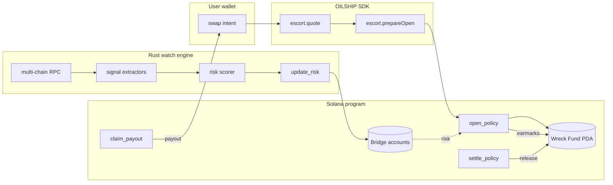
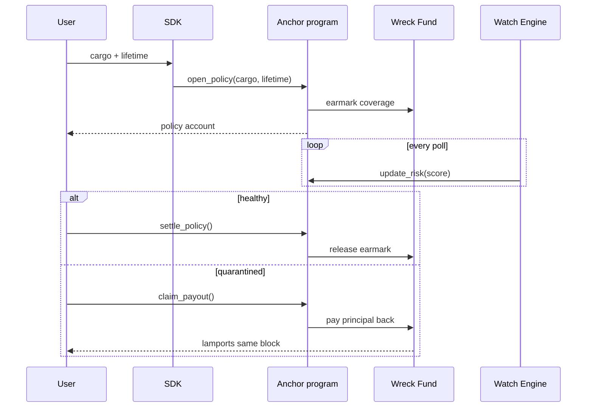
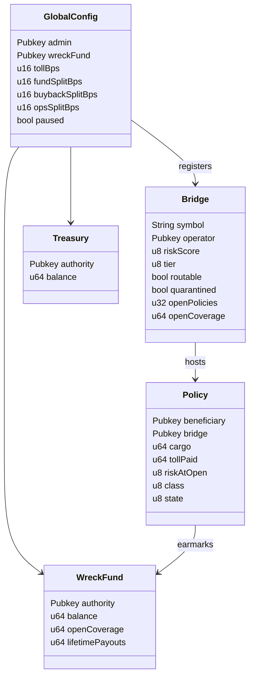

[](https://oilship.xyz/)
[](https://x.com/Oilship2026)
[](https://github.com/OilShip/OILSHIP)
[](https://github.com/OilShip/OILSHIP/actions/workflows/ci.yml)
[](./LICENSE)
[](https://oilship.xyz/)
[](https://solana.com)
[](https://www.anchor-lang.com/)
[](./sdk)
[](./watch)
[](https://oilship.xyz/)

**Website** · [oilship.xyz](https://oilship.xyz/) &nbsp;·&nbsp; **X** · [@Oilship2026](https://x.com/Oilship2026) &nbsp;·&nbsp; **Code** · [github.com/OilShip/OILSHIP](https://github.com/OilShip/OILSHIP)

# OILSHIP

On-chain bridge insurance for Solana. Anchor program + Rust risk engine + TypeScript SDK.

Since 2021, cross-chain bridges have lost more than **$2.8 billion** to exploits (Wormhole, Ronin, Nomad, Multichain, Orbit). Existing insurance protocols run on Ethereum, gate claims behind a 14-day DAO vote, and don't cover Solana routes at all. OILSHIP is a Solana-native protocol that prices bridge risk in real time, pulls a 10 bps toll per transit, and pays principal back from the on-chain Wreck Fund in the same block when a covered bridge gets quarantined.

## Features

| Feature | Status |
|---|---|
| Anchor program (`programs/oilship`) | stable |
| Risk scoring engine (`watch`) | stable |
| TypeScript SDK (`sdk`) | stable |
| Operator CLI (`cli`) | beta |
| Wreck Fund accounting (PDA) | stable |
| Multi-bridge router | beta |
| Same-block payout flow | stable |
| Dark fleet (split + time-spaced) | alpha |

---

## Architecture



Four components, all in this repo:

| Path | Component | Stack |
|---|---|---|
| `programs/oilship/` | On-chain program | Rust, Anchor 0.30, solana-program 1.18 |
| `watch/`            | Risk scoring engine | Rust, Tokio, solana-client |
| `sdk/`              | TypeScript SDK (zero runtime deps) | TypeScript, @solana/web3.js, @coral-xyz/anchor |
| `cli/`              | Operator CLI | Python 3.12, Typer, anchorpy |

---

## Mechanism



The toll a user pays is the **base toll** (10 bps of cargo) multiplied by a **risk multiplier** read off the bridge's current score:

| Score   | Multiplier | Tier   | State            |
|---------|------------|--------|------------------|
| 0-20    | 0.95x      | Tier 1 | primary route    |
| 21-40   | 1.00x      | Tier 1 | normal           |
| 41-60   | 1.15x      | Tier 2 | fallback         |
| 61-80   | 1.35x      | Tier 3 | rate-limited     |
| 81-100  | quarantine | block  | new policies revert |

Above score 80, the bridge is quarantined and the program refuses to open new policies on it.

## Performance

| Metric                       | Value           |
|------------------------------|-----------------|
| Risk score recompute window  | 1s              |
| Watch poll latency (p50)     | ~180ms          |
| `open_policy` instruction CU | ~28k            |
| `claim_payout` instruction CU| ~22k            |
| Same-block payout latency    | 1 slot (~400ms) |
| Wreck Fund accounting        | atomic per ix   |
| Concurrent policies / bridge | unbounded       |
| Coverage oversell guard      | hard revert     |

---

## On-chain accounts



---

## Token economics

`$OIL` is the company share. The protocol does one thing and the share captures cashflow from that one thing.

```
toll = bps_of(cargo, 10) * risk_multiplier(score)
   |
   +-- 60% --> wreck_fund    (grows the coverage cap)
   +-- 30% --> $OIL buyback  (direct to holders)
   +-- 10% --> operations    (RPCs, signers, infra)
```

| Quantity | Formula                                            |
|----------|----------------------------------------------------|
| NAV      | `wreck_fund + accrued_tolls - open_risk`           |
| APR      | `(tolls - payouts) / wreck_fund`                   |
| Floor    | `wreck_fund / circulating_supply`                  |
| TAM      | Solana monthly bridge inflow, measurable on chain  |

---

## Project structure

```
OILSHIP/
├── Anchor.toml                anchor workspace
├── Cargo.toml                 rust workspace
├── package.json               sdk workspace
├── rust-toolchain.toml
├── README.md
├── LICENSE
├── CONTRIBUTING.md
├── SECURITY.md
├── CHANGELOG.md
├── .github/workflows/
│   └── ci.yml                 rust + sdk + cli + docs jobs
├── assets/
│   ├── banner.png
│   └── logo.png
├── programs/oilship/src/
│   ├── lib.rs                 program entrypoint
│   ├── state.rs               GlobalConfig, Bridge, Policy, WreckFund, Treasury
│   ├── errors.rs              custom error codes
│   └── instructions/          initialize, register_bridge, update_risk,
│                              open_policy, settle_policy, claim_payout
├── watch/src/
│   ├── main.rs                tokio runtime entrypoint
│   ├── rpc.rs                 multi-RPC streaming
│   ├── filters.rs             anomaly extractors (12 signals)
│   ├── notifier.rs            risk score writer (update_risk caller)
│   ├── http_api.rs            local query api
│   ├── backfill.rs            historical replay
│   └── admin_audit.rs         admin key + signer rotation tracker
├── sdk/src/
│   ├── client.ts              OilshipClient
│   ├── escort.ts              quote, prepareOpen, openPolicy
│   ├── pda.ts                 PDA derivation helpers
│   ├── events.ts              event decoder
│   ├── simulator.ts           dry-run risk + toll
│   ├── receipts.ts            policy + payout receipts
│   └── version.ts
├── cli/oilship/
│   ├── state/dump.py          oilship state dump <pubkey>
│   ├── threat/simulate.py     oilship threat simulate scenario.json
│   └── policy/inspect.py      oilship policy inspect <pubkey>
└── docs/
    └── architecture.md
```

---

## Build

```bash
git clone https://github.com/OilShip/OILSHIP.git
cd OILSHIP

# on-chain program
anchor build

# risk scoring engine
cargo build -p oilship-watch --release

# typescript sdk
npm install
npm run build --workspace sdk

# operator cli
cd cli && pip install -e .
```

Anchor 0.30+, Rust 1.78+, Node 20+, Python 3.12+.

---

## Quick start

### Quote a transit (TypeScript SDK)

```ts
import { Connection, PublicKey } from "@solana/web3.js";
import { OilshipClient, Escort, solToLamports, pubkey } from "@oilship/sdk";

const client = new OilshipClient({
  connection: new Connection("https://api.mainnet-beta.solana.com"),
  programId: pubkey("OILshipxxxxxxxxxxxxxxxxxxxxxxxxxxxxxxxxxxxxx"),
});

const escort = new Escort(client, 10); // base toll, bps

const quote = await escort.quote({
  cargo: solToLamports(1.5),
  preferredBridge: "mayan",
});
// quote = {
//   cargo: 1500000000,
//   bridge: "mayan",
//   riskScore: 18,
//   tier: 1,
//   tollLamports: 1425000,
//   multiplier: 0.95,
//   route: ["mayan"],
//   coverageEarmark: 1500000000,
// }

const ix = await escort.prepareOpen(quote, walletPubkey);
// returns a TransactionInstruction ready to sign + send
```

### Read protocol state

```ts
const state = await client.getProtocolState();
// state = {
//   admin: "...",
//   wreckFund: "...",
//   tollBps: 10,
//   fundSplitBps: 6000,
//   buybackSplitBps: 3000,
//   opsSplitBps: 1000,
//   paused: false,
// }

const fund = await client.getWreckFund();
// fund = {
//   balance: 482730000000,
//   openCoverage: 311500000000,
//   solvency: 171230000000,   // balance - openCoverage
//   lifetimePayouts: 0,
// }
```

### Watch a bridge (Rust engine)

```bash
oilship-watch sample mayan
# polling mayan via 3 rpcs ...
# tvl baseline 41200000 sol, holders 12873
# admin key inspector ok
# signer set hash 0x9fa1...c4b2 (stable 7d)
# emitted score: 18 (tier 1, multiplier 0.95x)
```

### Simulate a risk scenario (CLI)

```bash
oilship threat simulate ./scenario.json
# bridge       : mayan
# baseline     : 18
# applied      : TvlDrop (high) + AdminKeyRotation (critical)
# new score    : 84
# verdict      : QUARANTINED (>= 81)
# action       : new policies on mayan will revert
```

`scenario.json`:

```json
{
  "bridge": "mayan",
  "anomalies": [
    { "kind": "TvlDrop", "severity": "high", "message": "tvl down 27% in 24h" },
    { "kind": "AdminKeyRotation", "severity": "critical", "message": "admin key moved twice" }
  ]
}
```

---

## Status

OILSHIP is **pre-launch**. The Wreck Fund is seeded at launch from the token raise, and the very first transit will be the team's own.

---

## Links

- **Website:** [oilship.xyz](https://oilship.xyz/)
- **Docs:** [oilship.xyz/docs](https://oilship.xyz/docs/)
- **X:** [@Oilship2026](https://x.com/Oilship2026)
- **GitHub:** [OilShip/OILSHIP](https://github.com/OilShip/OILSHIP)
- **Chain:** Solana
- **Ticker:** $OIL
